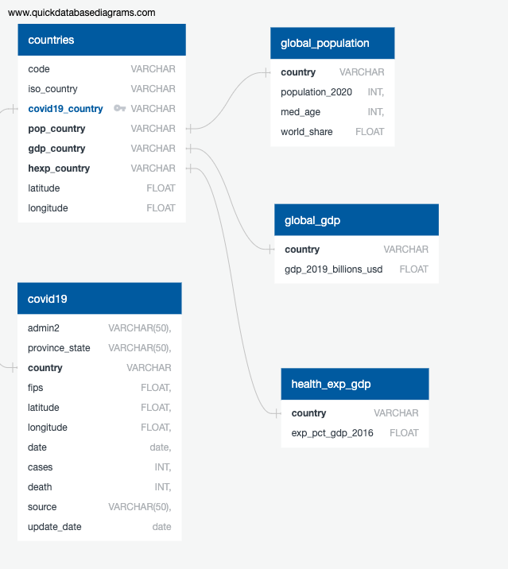
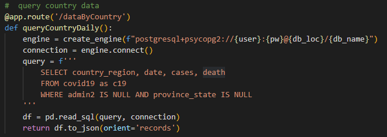

# Data Visualization Project

## Coronavirus Dashboard and Prediction
### Team: Arthur Chan, Lei Gu, Cindy Wagner and Jun Yang (April 2020)

### Scope
https://docs.google.com/document/d/1daK9q_31orQdcuOCwKs5_o7HbG0SOPchfXNsuwr-h1E/edit

## Description

The rapid spread of the virus that causes COVID-19 has sparked alarm worldwide. The World Health Organization (WHO) has declared this rapidly spreading coronavirus outbreak a pandemic, and any countries are grappling with a rise in confirmed cases. 
Because this is a new virus, there are still things we do not know, such as how severe the illness can be, how well it is transmitted between people, and other features of the virus. 

Therefore, we are collecting datasets and visualizing them to see if we can predict and find patterns of the virus. 

1. Any pattern vs GDP/capita, or public healthcare funding spends or index, temperature
2. Stage and pattern of the pandemic (research the terminology and concept of stages)
3. Population distribution and healthcare resources by Geo Mapping
4. Future projection

## Data Sources

1.	[Country-Level Data] Johns Hopkins full dataset (https://github.com/CSSEGISandData/COVID-19/tree/master/csse_covid_19_data/csse_covid_19_daily_reports). Available as csv file.

2.	[State and County-Level Data] New York Times US dataset (https://github.com/nytimes/covid-19-data). Available as csv file.

## Data manipulation and cleanup
1.	Check for duplicates and missing data
2.	Remove and rename columns
3.	Drop NAs and zeros
4.	Change data types to correct types 

All data are loaded to PostgresSQL. Data are organized into 5 tables.
- countries
- global_population
- covid19
- health_exp_gdp
- global_gdp

Database stucture also illustrated with diagram below.

## Flask
Javascript calls flask api to query data from PostgreSQL

## Libraries 
- Bootstrap for layout
- Leaflet for map
- D3
- Highcharts for charts
- Plotly for charts
- Awesome Fonts for icons
